# 🌌 Nebula — Premium Social Media Platform

> A production-ready, full-stack social media application built with **Node.js**, **Express.js**, **MySQL**, and **Bootstrap 5**. Featuring a responsive glassmorphic UI, real-time message polling, activity hub, hashtag indexing, and native light/dark mode linking.
> CodeAlpha Internship — Task 2 (Fully Completed & Polished)

---

## 📸 Pages & Features

### 1. Registration
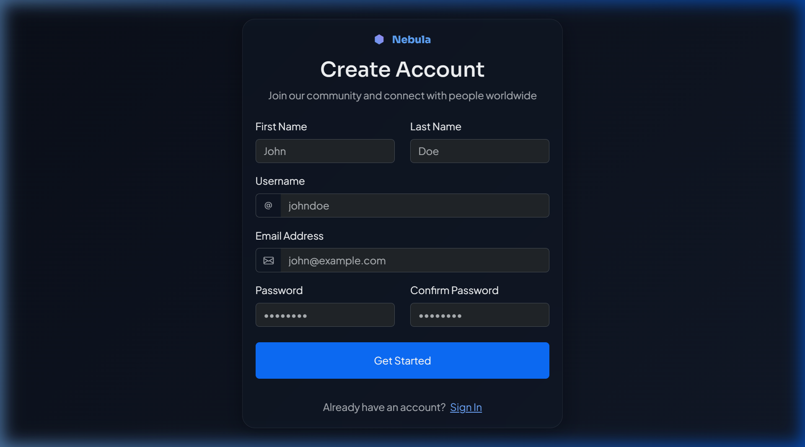
**Description:** The gateway to create a new account. Features real-time input validation (matching passwords, length checks) and a modern, glassmorphic secure form design.

### 2. Login
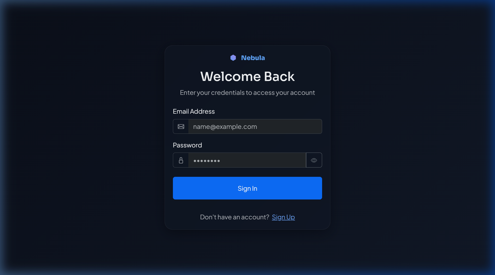
**Description:** The sign-in portal. Authenticates users via secure JWT tokens, validating credentials against the encrypted database records before granting access.

### 3. Feed / Home (Dark Mode)
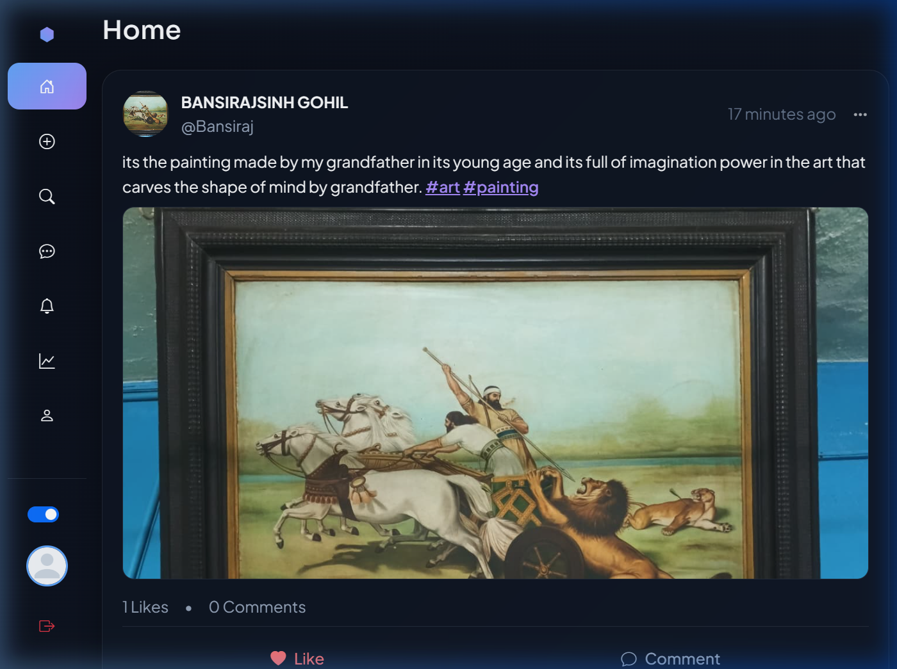
**Description:** The primary landing workspace featuring a continuous stream of posts from the user and followed accounts. Supports infinite scroll pagination, instant liking, and an elegant dark theme.

### 4. Feed / Home (Light Mode)
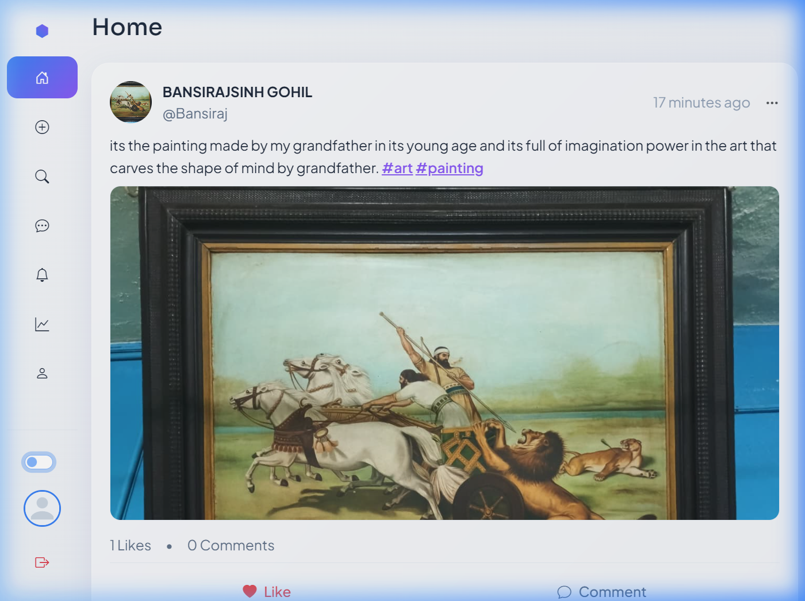
**Description:** The same seamless feed experience, instantly toggleable to a bright, clean light theme that maintains all visual hierarchies and readability.

### 5. Direct Messaging (Inbox)
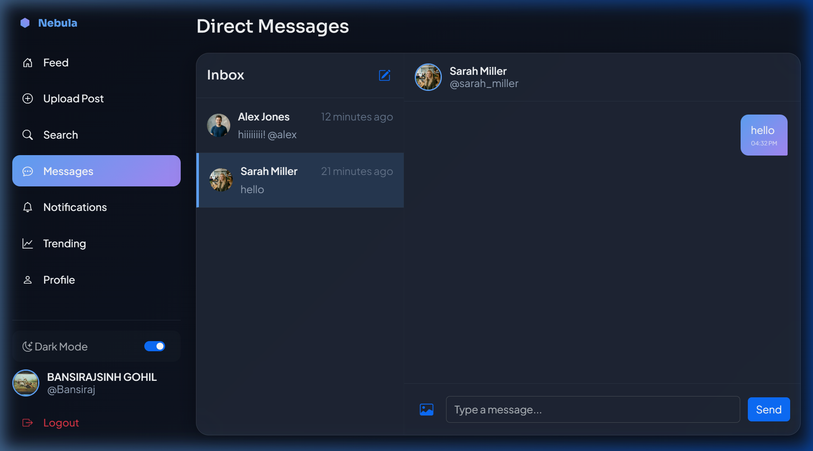
**Description:** A split-screen communication dashboard. The left panel shows recent conversations, while the right panel displays real-time message streams with read receipts and smooth polling.

### 6. Upload Post
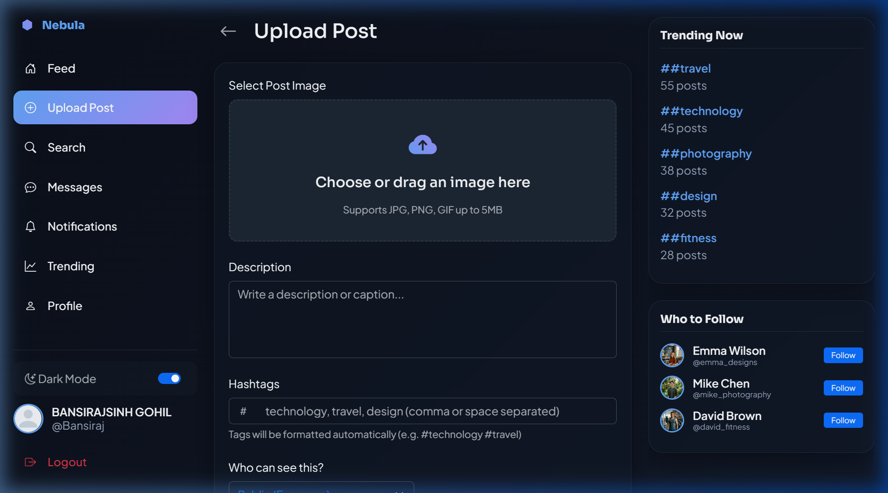
**Description:** A dedicated creation interface allowing users to upload image attachments (with drag-and-drop support), write descriptions, and automatically index hashtags before publishing.

### 7. User Profile
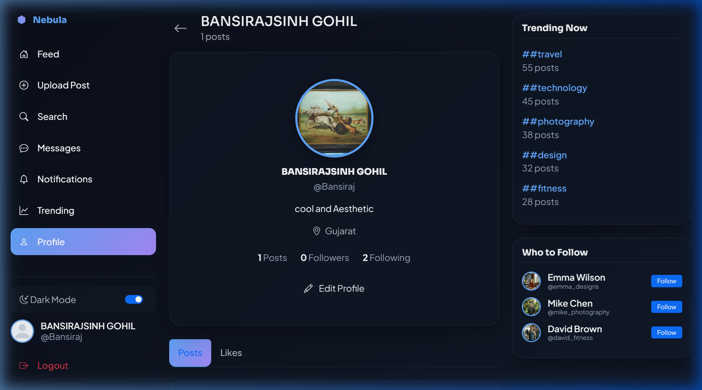
**Description:** A centered profile card displaying user details, verification status, biography, follower/following counts, and an interactive grid of their personal posts.

### 8. Edit Profile
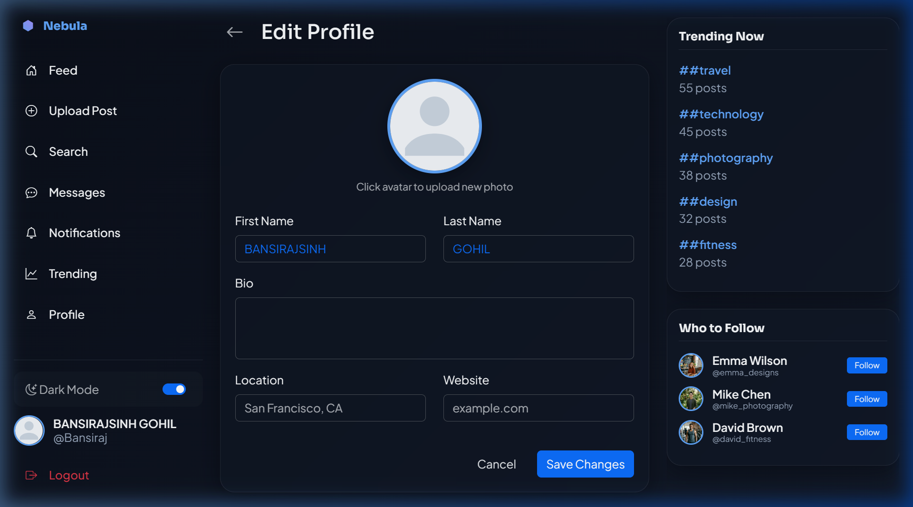
**Description:** The settings interface where users can securely update their personal details, biography, location, and upload a new avatar with instant live previewing.

### 9. Live Search
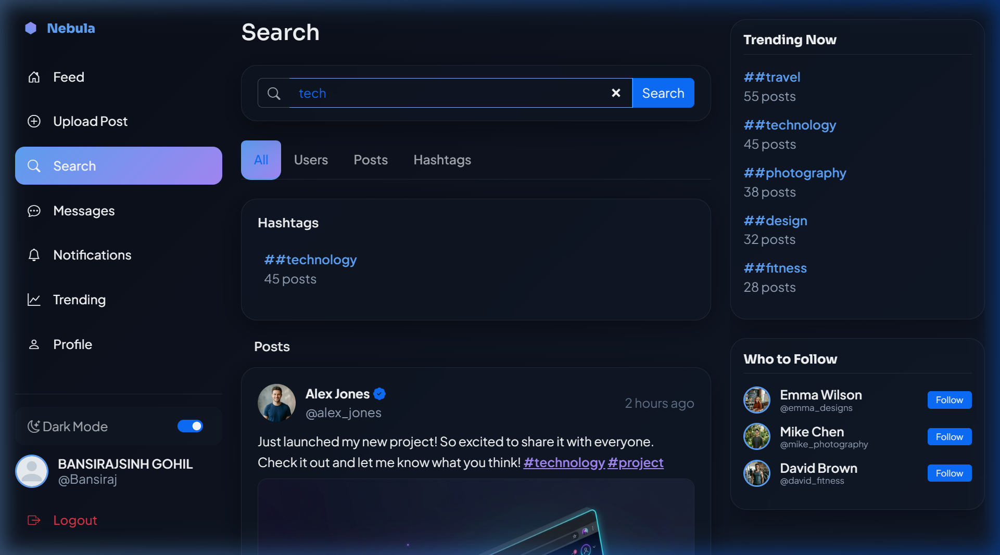
**Description:** A robust discovery engine with multi-tab support, allowing users to query and find other accounts, specific posts, and trending topics instantly.

### 10. Activity Hub (Notifications)
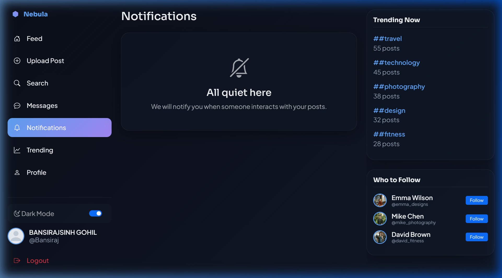
**Description:** A comprehensive log of interactions including new followers, post likes, and comments, marked with visual badges and click-to-view routing.

### 11. Trending Now
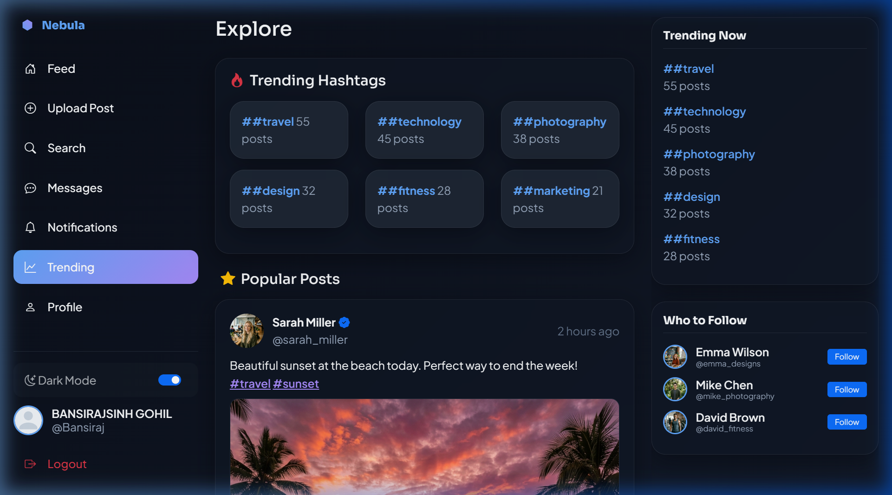
**Description:** The platform's pulse, showcasing top utilized hashtags, most engaged posts, and personalized suggestions for new accounts to follow.

---

## 🔄 User Flow

1. **Onboarding:** A guest arrives and navigates to the **Registration** page to create an account.
2. **Authentication:** The new user is redirected to the **Login** page, enters credentials, receives a secure token, and logs in.
3. **Exploration:** The user lands on the **Feed**, browsing recent posts from the platform.
4. **Discovery:** The user visits **Trending Now** and **Live Search** to find topics of interest and accounts to follow.
5. **Creation:** The user navigates to **Upload Post**, adds a photo and hashtags, and publishes their content.
6. **Interaction:** The user views their **Activity Hub** to see likes on their new post, then visits **Direct Messaging** to chat with a friend.
7. **Personalization:** Finally, the user goes to **Edit Profile** to refine their public image, updating their bio and avatar.

---

## 📁 Detailed Project Structure

```text
├── database/
│   ├── schema.sql           # Defines database tables and relationships
│   ├── seed.sql             # Populates initial test data (users, posts)
│   ├── triggers.sql         # Automates atomic counters (likes, comments)
│   └── views.sql            # Creates optimized queries for feeds and trends
├── public/
│   ├── assets/              # Contains static images, icons, and uploaded media
│   ├── css/                 # Vanilla CSS files handling glassmorphism, responsive design, animations, and themes
│   ├── js/                  # Frontend logic separated by feature (feed, messages, auth, utils)
│   └── *.html               # All frontend views (index, login, register, profile, messages, etc.)
├── screenshots/             # Interface captures for documentation
├── server/
│   ├── config/              # Database connection and environment variables
│   ├── controllers/         # Handles incoming HTTP requests and formats responses
│   ├── middleware/          # JWT authentication and Multer file upload handlers
│   ├── repositories/        # Direct database SQL execution layer
│   ├── routes/              # Express API route bindings to controllers
│   ├── services/            # Core business logic and data validation
│   ├── utils/               # Shared helper functions (response formatting)
│   ├── app.js               # Express application initialization
│   └── index.js             # Server startup entry point
├── .env.example             # Template for required environment variables
├── package.json             # NPM dependencies and run scripts
└── README.md                # Project documentation
```

---

## 🚀 Quick Start

### 1. Clone & Install
```bash
git clone https://github.com/bansirajsinh/SocialMediaPlatform.git
cd SocialMediaPlatform
npm install
```

### 2. Database Setup
```bash
mysql -u root -p < database/schema.sql
mysql -u root -p social_media_app < database/triggers.sql
mysql -u root -p social_media_app < database/views.sql
mysql -u root -p social_media_app < database/seed.sql
```

### 3. Environment
Copy `.env` and set your credentials.

### 4. Run Server
```bash
npm run dev
```
Open **http://localhost:3000** in your browser.

---

## 📡 API Architecture Highlights
- **Design Pattern:** MVC (Model-View-Controller) / RESTful API.
- **Frontend:** Vanilla JS, Custom CSS (Glassmorphism, Light/Dark Modes).
- **Backend:** Node.js, Express.js.
- **Database:** MySQL 8.0 with pre-compiled triggers and views.

